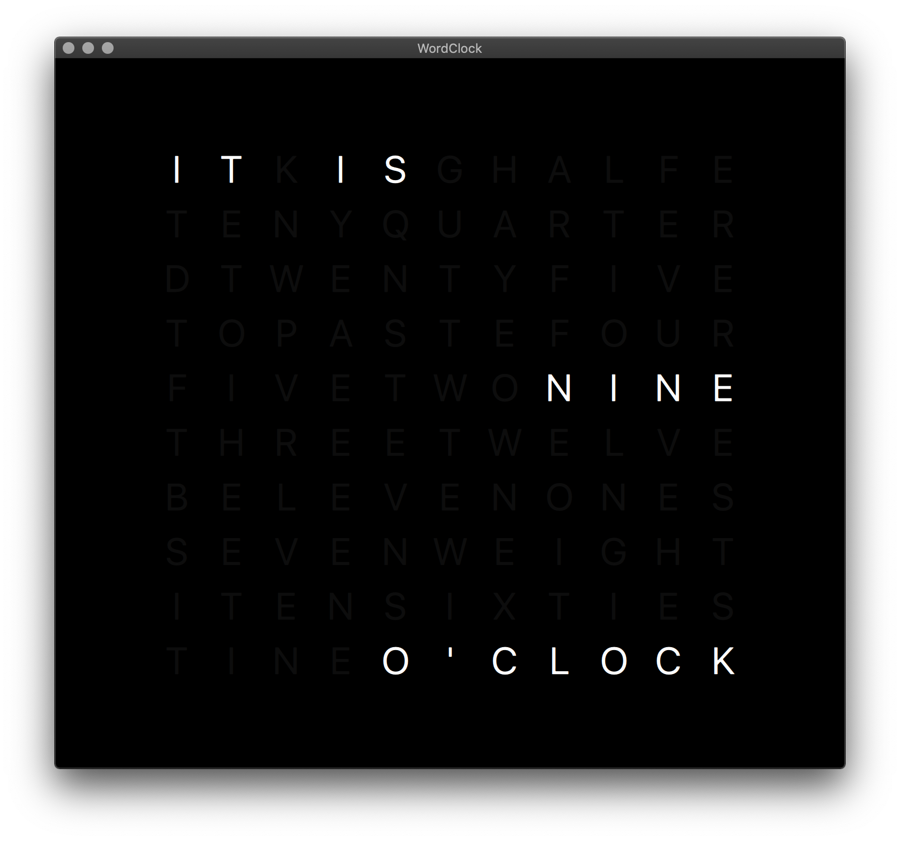

# WordClock
A word clock for your desktop written in QML.



## Deploy (macOS)

```
make clean
qmake -config release
make
macdeployqt WordClock.app
cp icon/icon.icns WordClock.app/Contents/resources
```

now edit in `Info.plist`

```xml
<key>CFBundleIconFile</key>
<string>icon.icns</string>
```

And create the dmg
```
macdeployqt WordClock.app -dmg
```
